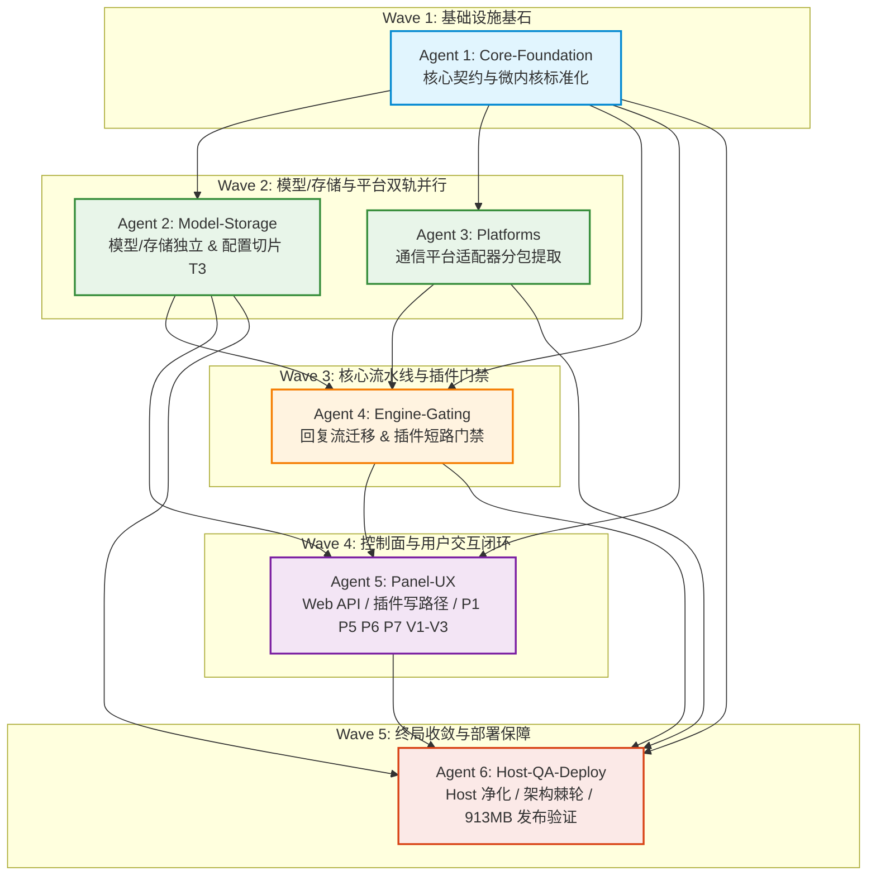

# 多 Agent 协同重构调度总纲与依赖拓扑矩阵

> **文档标识**：`docs/plans/agents/00-orchestration-and-dependency-graph.md`\
> **所属方案**：BotAgent 模块化重构与功能插件化演进方案 (`modular-monolith-refactoring-plan.md`)\
> **适用对象**：协作执行重构任务的 AI Agents 与人类架构监督者\
> **更新时间**：2026-10-06\

---

## 1. 协作设计理念与总原则 (Core Philosophy)

为了将 2.5 万行核心单体平稳、低风险、零运行时额外开销地演进为模块化单体（Modular Monolith）与插件系统，同时解决 PR #86 遗留待办（P1, P5, P6/P7, V1-V3）与技术债（T1-T3），必须将庞大的工程拆分为多个**可独立认领、物理边界清晰、契约完备、验证闭环**的执行任务。

本套调度体系严格遵循以下准则：
1. **单一写权属（Single Ownership）**：同一时刻，一个文件或模块只能由一个 Agent 独占拥有写权限，杜绝多 Agent 协同修改同一文件造成的冲突。
2. **前置契约依赖（Contract-First & Strict DAG）**：所有模块间调用只依赖接口与领域模型，上游 Agent 产出稳定契约后下游方可动工。
3. **分波次并行（Wave-Based Execution）**：无直接依赖的任务（如 Model 与 Platforms）允许跨 Agent 并发执行，有依赖的任务分波次有序推进。
4. **探针步步为营（Step-by-Step Quality Gates）**：每个 Agent 交付前必须通过针对该模块的自测与全系统探针回归，严禁“改完不跑测试”。

---

## 2. Agent 角色责任矩阵 (Role & Responsibility Matrix)

| Agent 编号 | 专职角色 | 负责子文档 | 核心交付物 / 职责范围 | 预估输入与前置依赖 |
| :--- | :--- | :--- | :--- | :--- |
| **Agent 1** | **Core-Foundation** (核心基础底座) | `01-agent-core-foundation.md` | • 创建 `BotAgent.Core` 工程与更新 `BotAgent.slnx` • 下沉领域模型、时钟网络适配器 • 标准化 `IBotPlugin` 与微内核注册表契约 | 无（基于 `main` 基线启动） |
| **Agent 2** | **Model-Storage** (模型与存储切片) | `02-agent-model-and-storage.md` | • 创建 `BotAgent.Model` 与 `BotAgent.Storage` • 迁移五档思考深度与 OpenAI 传输 • 拆分巨石 `AppSettings`（消除 T3） • 插件状态持久化存储 | 依赖 **Agent 1** 交付物 (`BotAgent.Core.dll`) |
| **Agent 3** | **Platforms** (协议平台适配器) | `03-agent-platforms-extraction.md`| • 创建 `BotAgent.Platforms` • 隔离迁移 OneBot、Official、Feishu、Local • 统一适配器事件与平台策略 | 依赖 **Agent 1** 交付物 (`BotAgent.Core.dll`) |
| **Agent 4** | **Engine-Gating** (主链与插件门禁) | `04-agent-engine-and-gating.md` | • 创建 `BotAgent.Engine` • 迁移 ReplyPipeline、AgentTurnLoop • 实施预设插件物理短路门禁（四大脱节 1&2） • 宿主生命周期挂载 StartAll/StopAll | 依赖 **Agent 1, Agent 2** 交付物 |
| **Agent 5** | **Panel-UX** (控制面与待办闭环) | `05-agent-panel-and-ux-backlog.md` | • 创建 `BotAgent.Panel`（Web API + SPA） • 实现底栏显隐手势（P1）与保存按钮收敛（P5） • 插件中心视觉优化（P6/P7）与写端点（脱节 3） • 模态闭环断言扩充（V1-V3） | 依赖 **Agent 1, Agent 2, Agent 4** |
| **Agent 6** | **Host-QA-Deploy** (宿主收口与全景验收) | `06-agent-host-guardrails-and-deploy.md`| • 宿主 `BotAgent.Headless` 极简化收敛 • 升级 `ArchitectureProbe` 92+ 项规则（DAG 防破窗） • 全景探针与 S21/S36/S52 集成测试回归 • 验证本地 `publish` 平铺与 AWS 913MB 单进程部署红线 | 依赖 **Agent 1 ~ Agent 5** 全部交付物 |

---

## 3. 依赖拓扑图与执行波次 (DAG & Waves)

### 3.1 波次推进时序

- **【Wave 1】独占基石阶段**：
  - 仅 **Agent 1** 运行；
  - 产出：`BotAgent.Core.csproj` 及稳定的命名空间 `BotAgent.Domain.*`；
  - 准入门禁：`BotAgent.Core` 单独编译通过，旧项目引用 Core 编译通过，`ArchitectureProbe` 不报循环依赖。
- **【Wave 2】双轨并行阶段**：
  - **Agent 2** 与 **Agent 3** 同时并发推进，互不干扰；
  - Agent 2 独占修改 `Services/Model`, `Services/Settings`, 数据库存储相关代码；
  - Agent 3 独占修改 `Services/OneBot`, `Services/Official`, `Services/Platforms`, `Services/Local`；
  - 准入门禁：`BotAgent.Model`、`BotAgent.Storage`、`BotAgent.Platforms` 独立编译通过，`SafetyProbe` 模型与设置测试全绿。
- **【Wave 3】流水线装配阶段**：
  - **Agent 4** 接入，整合 Core、Model、Storage 产物；
  - 核心工作：建立 `BotAgent.Engine`，在 `ReplyPipeline.cs` 插入 `_pluginRegistry.IsEnabled` 物理短路；
  - 准入门禁：回复链路单元测试全绿，插件禁用测试 100% 阻断。
- **【Wave 4】控制面与前端交互阶段**：
  - **Agent 5** 接入，基于 Storage 的插件状态与 Engine/Core 开关，实现前端 API 与 UI；
  - 核心工作：实现 `POST /api/plugins/{id}/enable`、底栏手势 P1、保存按钮收敛 P5、插件卡片美化 P6/P7；
  - 准入门禁：`probe.mjs` 测试扩充至 360+ 项全绿，移动端/桌面端交互正常。
- **【Wave 5】全局收敛与部署验收阶段**：
  - **Agent 6** 统一收口，重构 `Host/Program.cs` 与 `Host/CompositionRoot.cs`；
  - 升级 `ArchitectureProbe`（更新 `Baseline.cs`），执行全套集成测试矩阵（S21/S36/S52）；
  - 本地发布构建，验证发布物与单进程内存占用约束。

---

## 4. 目录与文件权属隔离规范 (File Ownership Rules)

为避免多个 Agent 产生代码覆盖与 Git 冲突，各 Agent 的读写边界划分如下：

| Agent | 独占写权限目录 / 文件 | 只读引用（禁止修改） |
| :--- | :--- | :--- |
| **Agent 1** | • `src/BotAgent.Core/` (新建) • `BotAgent.slnx` • `src/BotAgent.Headless/Domain/` (下沉迁移) | 其他所有目录 |
| **Agent 2** | • `src/BotAgent.Model/` (新建) • `src/BotAgent.Storage/` (新建) • `src/BotAgent.Headless/Services/Model/` • `src/BotAgent.Headless/Services/Settings/` | `src/BotAgent.Core/` |
| **Agent 3** | • `src/BotAgent.Platforms/` (新建) • `src/BotAgent.Headless/Services/Platforms/` • `src/BotAgent.Headless/Services/OneBot/` • `src/BotAgent.Headless/Services/Official/` | `src/BotAgent.Core/` |
| **Agent 4** | • `src/BotAgent.Engine/` (新建) • `src/BotAgent.Headless/Services/Reply/` • `src/BotAgent.Headless/Services/Agent/` (非模型传输部分) | `src/BotAgent.Core/` `src/BotAgent.Model/` `src/BotAgent.Storage/` |
| **Agent 5** | • `src/BotAgent.Panel/` (新建) • `src/BotAgent.Headless/Services/Panel/` • `src/BotAgent.Headless/wwwroot/` (全量静态资源) • `tests/BotAgent.FrontendProbe/probe.mjs` | `src/BotAgent.Core/` `src/BotAgent.Engine/` `src/BotAgent.Storage/` |
| **Agent 6** | • `src/BotAgent.Headless/Host/` • `tests/BotAgent.ArchitectureProbe/Baseline.cs` • `tests/BotAgent.ArchitectureProbe/Program.cs` • 根级配置与部署校验脚本 | 全项目所有源码与测试工程 |

---

## 5. 跨 Agent 共享不可逾越的红线 (Shared Guardrails)

所有参与执行的 Agent 必须严格遵守以下物理与架构红线：
1. **脱敏红线**：严禁在任何测试、探针、断言、注释、日志或文档中输出真实 QQ 号、群号、群聊正文、昵称、个人密钥或内网 IP。必须使用合规占位符（如 `10001`、`群友A`、`example.com`、`sk-test-mock`）。
2. **物理单进程与内存红线**：生产环境 AWS EC2 为 913MB RAM（带 2GB Swap）。本次重构是 **Modular Monolith**，绝非微服务！最终编译产物必须依然由 `BotAgent.Headless` 启动单一进程，严禁设计任何跨进程 IPC 或独立外部服务守护。
3. **思考深度契约红线**：保留并传递全部五档思考深度设置（`none`/`low`/`medium`/`high`/`xhigh`）与自定义配置，`none` 必须明确透传至 API 报文，不得遗漏。
4. **端口默认规范**：健康检查/面板默认端口统一为 `18245`（兼容 `8080`），不可倒退回已废弃的历史端口配置。
5. **架构探针“只紧不松”原则**：`ArchitectureProbe/Baseline.cs` 中的阈值是单向棘轮，只允许随着模块解耦调小，严禁因测试失败而调大阈值。

---

## 6. 回退预案与冲突熔断机制 (Rollback & Circuit Breaker)

若某一 Agent 在执行过程中发生不可逆破坏（例如编译大面积报红或既有 594 项探针失效）：
1. **分支隔离**：建议每个 Agent 在各自的隔离特性分支工作（例如 `refactor/wave1-core`, `refactor/wave2-model-store` 等）；
2. **快速回滚**：若某 Wave 验收大门未通过，不得盲目推送或合并，直接使用 `git checkout -f` 丢弃本 Agent 脏改动，排查契约后再行迭代；
3. **最小变更准则**：代码迁移过程必须先“原样搬迁+命名空间对齐”，确保编译通过并锁死契约后，再做细节重构，严禁同时进行大面积重写与跨层搬迁。
